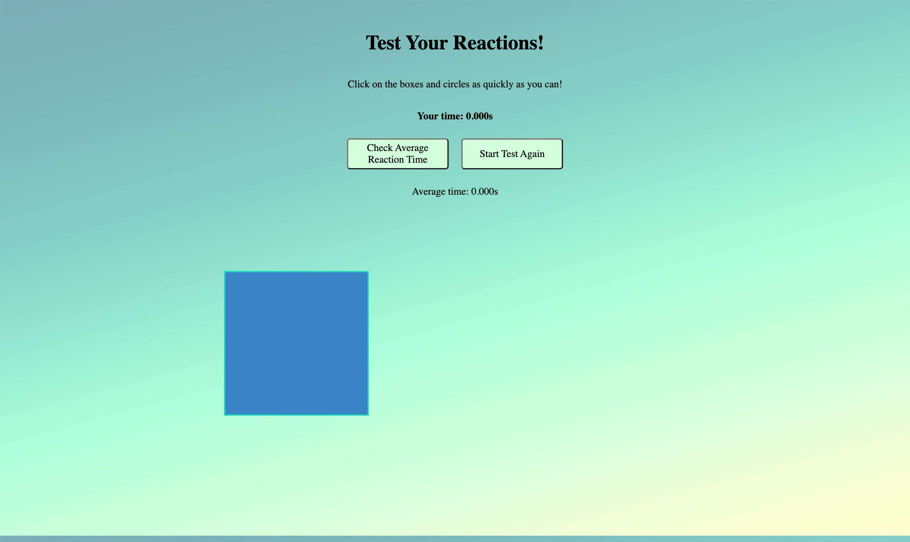

# Test-Your-Reactions
A reaction tester page requiring the user to click randomly appearing shapes

**Description:**
A simple web-based reaction tester that displays random shapes and allows you to measure your reaction time. The tester includes a button to calculate the average reaction time and reset the test.

**Link to project:** [Test Your Reactions](https://test-your-reactions.netlify.app/)

# Desktop View

# Mobile View

# Working

# Features

- Randomly displays various shapes on the screen
- Measures the time it takes for the user to click on the shape
- Calculates the average reaction time
- Provides a button to reset the test

# Technologies Used

- HTML
- CSS
- JavaScript

# Usage

- Open the web page in your browser.

- Click on the shapes as quickly as possible when they appear on the screen.

- Reaction time appears as your click the randomly generated shapes.

- After clicking on several shapes, click the "Calculate Average Reaction Time" button to see the average reaction time.

- To reset the test and start again, click the "Reset" button.

# Customization

You can customize the project according to your needs:

## Contact

For any questions or inquiries, please contact the project maintainer at [Rabia Butt](mailto:air.bay.x@gmail.com?subject=[GitHub]%20Source%20Han%20Sans)

